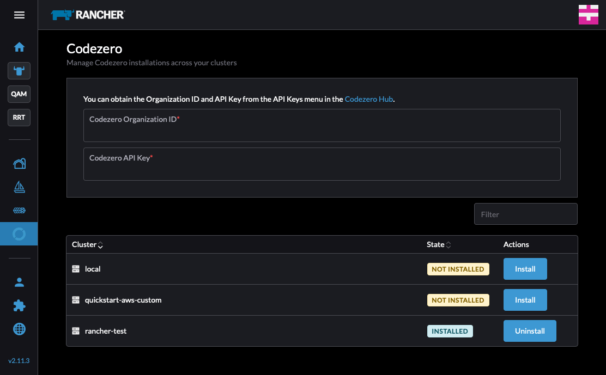

# Codezero Rancher Extension

This extension allows easy one-click installations of Codezero's Space Agent into Rancher clusters.

## Prerequisites

1. Ensure you are running Rancher version 2.10.0 or later.
2. You must be logged into the Rancher dashboard as an admin user.
3. You must have a Codezero account.

## Usage

1. Copy your Organization ID and Organization API Key from the [Codezero Hub](https://hub.codezero.io/api-keys)
2. Click the "Install" button next to the cluster that you want to install Codezero to.

## Support

For support, please contact [Codezero](https://codezero.io/contact-us).